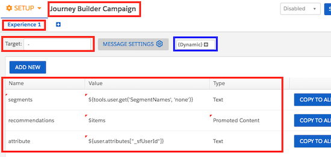

# JBIS: Marketing Cloud Journey Builder activity for Interaction Studio

## Installation

 

or 

`npm install && npm run build && npm run start`

## Description

JBIS is a Custom Journey Builder activity that allows to send Interaction Studio Actions/Events directly from Journey Builder, and to receive IS consumer profile back in MC. 

In a nutshell, this activity allows you to receive segment membership and recommendations (and other information) from IS and use this information in your Journey. For example for smart real-time decision splits or anything else.

The following profile information is sent back to MC:
* List of segments
* List of recommendations (based on any recipe)
* Up to three user attributes
* User Group (values could be either “Control” or “Default” for IS A/B tests)
* Experience

## What can be done

JBIS allows to receive real-time information about a customer from Interaction Studio. This information can be used to for:

* Next Best Path decision splits in journeys - based on the recommendations from Recipes/Bandit, segments or experiences
* Data capture - save captured information to dataextensions to process it later
* Build Segments in IS based on the Journeys user is in

## High-level architectural diagram

## Interaction Studio setup

### Open IS and create a new “Server Side Campaign”

### Configure campaign output

* Set the name of the Campaign
* Set the name of the Experience
* Set the value of the Target attribute (could be any non-empty value, eg: “-”) 
* Add the following fields. _All fields are optional_. Use Attributes (attribute, attribute2, attribute3) to pass any information back to MC. *Attribute valuesare just examples*

### IMPORTANT: When profile data can't be sent back to MC (When Server-Side campaigns are not returned):

* A campaign includes “Promoted Content” (eg: recipe recommendations) and this recipe does not return the min number of required recommendations. Make sure that your recipe returns smth for your test users
* A campaign includes a “Custom User Attribute” and the user does not have a value set for this attribute. Make sure that your test users have values for the attributes used in the campaign. _*Check a small workaround below*_

*Preview your Server-Side Campaigns for your test users before setting up a Journey in MC* 
*All fields described below are optional. Only use the ones that you need in your journey*

### Workaround for “Custom User Attributes”

Use the following pattern for Custom User Attributes:

`#field([YOUR_USER_ATTRIBUTE_SUBSTITUTION_STRING], '')`

#### Example:

Attribute substitution string: 

`${user.attributes.country}`

Value that you should use in your Server-Side campaign: 

`#field(${user.attributes.country}, '')`

Name | Value | Type | Description
--- | --- | --- | ---
segments | ${tools.user.get('SegmentNames','none')} | Text | Comma separated list of segments.
recommendations | $items | Promoted Content | Comma separated list of recommended item IDs
attribute | Example: #field(${user.attributes.country},'') | Text | Any attribute. Use "Dynamic" attribute selector menu. EG: ${user.attributes.country}
attribute2 | Example: #field(${user.attributes.language},'') | Text | Any attribute. Use "Dynamic" attribute selector menu. EG: ${user.attributes.country}
attribute3 | Example: #field(${user.attributes.score},'') | Text | Any attribute. Use "Dynamic" attribute selector menu. EG: ${user.attributes.country}

### Configure recommendations (if required)

IMPORTANT: A Server-Side campaign with recommendations is not returned to a user, if the recipe does not return any recommendations for this user. If you use recommendations, make sure that your recipe always returns smth for all users or use STATIC recommendations instead of recipes.

* Click “Message Settings”
* Open “Promoted Content” tab
* Select “Recommendations” as the Type
* Select the recipe you would like to use
* Set the “Item IDs only” flag

### Optional setup

Optionally configure different experiences and campaign targeting in the setup section of the Server-Side campaign

### Save and publish your Server-Side campaign

## Marketing Cloud Setup

### Installed package

* Open MC Setup section
* Go to Installed packages
* Create new Package and call it JBIS
* Add a new Component
* Select “Journey Builder Activity”
* Click “Next”

* Set JBIS as a name
* Use “Custom” as a category
* Use the URL of your deloyed application as the “Endpoint URL”. EG: https://my-test-jbis-activity.herokuapp.com
* Grant access to all BUs
* Save everything and go to Journey Builder

### Using JBIS custom activity

* Create a new Journey 
* Add a JBIS custom activity to the journey canvas 
* JBIS should be located under the “Customer Updates” section
* Open activity and configure it as described below

* *Account and region* - a subdomain of your IS account. If your IS account is connected to your MC instance, the easiest way to get this value is to open “Feeds Dashboard” from the "Feeds" section of the main menu. Open feeds dashboard, it will be opened in a new window. Check the URL in your browser. The value that you need goes *_before_* ".evergage.com". It can include a location suffix (sagadzhanov123456.germany-2) or not (interactionstudio)
    Examples: 
    * *_interactionstudio_*.evergage.com
    * *_sagadzhanov123456.germany-2_*.evergage.com
* *Dataset* - the name of your target dataset
* *UserID field* - which MC attribute will be to as a UserID in IS
* *IS Action* - which action will be sent to IS
* *IS Campaign* - the name of the Server-Side campaign created in IS
* *Authentication Config* - new datasets require all API calls to be Authenticated. If you see a 401 error message when sending a test Event, then your dataset only accepts authenticated API calls and you’ll have to follow instructions below: 
    * Create an API Token (https://doc.evergage.com/display/EKB/API+Tokens)
    * Use the following string in the Authentication Config field:
    
        {YOUR_API_KEY_ID}:{YOUR_API_KEY_SECRET}
        
        EG: aaa-aaa-aaa:abcd

### Configure a decision split

* Add a Decision Split activity after the JBIS activity
* Create a decision path
* In “Attribute Groups” select “Journey Data”, then “Custom Activity: JBIS”
* Build filtering conditions based on the attributes returned by IS

### Save data to a dataextension

* Add Update Contact activity after JBIS activity
* Select a target dataextension
* Use output substitution strings as values

