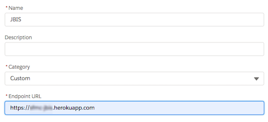
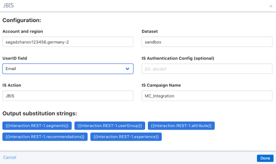
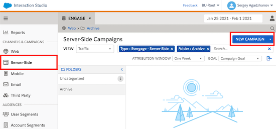
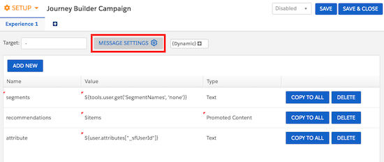
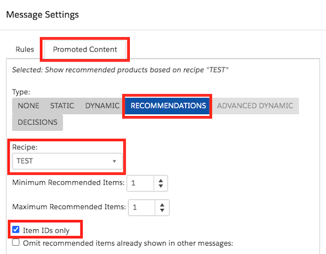

# JBIS 2.0: Marketing Cloud Journey Builder activity for Interaction Studio

Documentation below covers v2.0 of the JBIS activity. This version includes a lot of great improvements, such as:
* Support of Multiple Identities
* Improved Security:
  * Interaction Studio API token is now configured on the backend and is never exposed to the UI
  * All Event API calls from Journey Builder to Interaction Studio are now signed and validated by JBIS 
  * All internal API calls are also validated
* Simpler Activity configuration
  * Dataset is selected with the dropdown list
  * Only 4 paramers have to be configured: Dataset, Action Name, Identity Attribute and its value
  * Easy Activity Test UI with output arguments visualization
* Flexible Server-Side Campaign tempate and Activity output arguments. All selected attributes will become available to the Down Stream activities in your Journey 

## Installation

 

or 

`npm install && npm run build && npm run start`

## Description

JBIS is a Custom Journey Builder activity that allows to send Interaction Studio Actions/Events directly from Journey Builder, and to receive IS consumer profile back in MC. 

In a nutshell, this activity allows you to receive segment membership and recommendations (and other information) from IS and use this information in your Journey. For example for smart real-time decision splits or anything else.

The following profile information is sent back to MC:
* User attributes
* User segments
* Recommendations (based on any recipe)
* User Group (values could be either “Control” or “Default” for IS A/B tests)
* Experience
* And anything else that can be returned by a Server-Side campaign

## What can be done

JBIS allows to receive real-time information about a customer from Interaction Studio. This information can be used to for:

* Next Best Path decision splits in journeys - based on the recommendations from Recipes/Bandit, segments or experiences
* Data capture - save captured information to dataextensions to process it later
* Build Segments in IS based on the Journeys user is in

## High-level architectural diagram

## Setup 

To set up an activity on your Marketing Account you'll have to complete the following steps:
* In Interaction Studio: 
  * Create a new Server-Side Campaign tempate. Use [this code](https://raw.githubusercontent.com/Bizcuit/bizcuit-sfmc-jbis/master/server-side-campaign/ssc-template.v2.txt) for the template
  * Create a new Server-Side Campaign using this template, configure and publish it. Optionally configure Campaign Targeting for the campaign to be returned only in case a specific Action is sent
  * Create a new API Token and save your API Key ID and API Key Secret
* In Marketing Cloud: 
  * Create a new Package and save yout JWT Secret Key from the Package setup screen
  * Locate and save your Marketing Cloud EID (Enterprise Business Unit ID - ID of your parent Business Unit)
* Deploy and Start JBIS application in your private or public cloud environment. You can easily do it with one click using [heroku deployment](https://heroku.com/deploy?template=https%3A%2F%2Fgithub.com%2FBizcuit%2Fbizcuit-sfmc-jbis%2Ftree%2Fmaster), but you can also use any other hosting provider.
* Configure five environment variable for your application:
  * IS_API_BASEURL - your Interaction Studio Base URL. For example: https://<companyname>.us-1.evergage.com or https://<companyname>.germany-2.evergage.com. You can find it in the URL by navigating to Gears > Gears and viewing the URL in the address bar of your browser
  * IS_API_KEY - your Interaction Studio API Key ID
  * IS_API_SECRET - your Interaction Studio API Key Secret
  * MC_EID - your Marketing Cloud EID
  * MC_JWT_SECRET - your Marketing Cloud Package JWT Secret Key
* In Marketing Cloud: 
  * Add a new Component to your Package
  * Select “Journey Builder Activity”, Click “Next”
  * Set JBIS as a name
  * Use “Custom” as a category
  * Use the URL of your deloyed application as the “Endpoint URL”. EG: https://my-test-jbis-activity.herokuapp.com
  * Grant access to all BUs
  * Save everything and go to Journey Builder

### Using JBIS custom activity

* Create a new Journey 
* Add a JBIS custom activity to the journey canvas 
* JBIS should be located under the “Customer Updates” section
* Open activity and configure it as described below
  * *Dataset* - IS dataset
  * *IS Action* - which action will be sent to IS
  * *IS Identity Attribute* - the name of the IS Identity Attribute. Eg: "sfmcContactKey" or "emailAddress"
  * *UserID field* - which MC attribute will be sent to IS as a User Identity Attribute Value. Eg:  
* Click "Validate Activity and update Output Parameters" button to check if your IS Server-Side campaign is working and that correct results are returned back to Journey Builder.

### Configure a decision split

* Add a Decision Split activity after the JBIS activity
* Create a decision path
* In “Attribute Groups” select “Journey Data”, then “Custom Activity: JBIS”
* Build filtering conditions based on the attributes returned by IS

### Save data to a dataextension

* Add Update Contact activity after JBIS activity
* Select a target dataextension
* Use output substitution strings as values

### ===========================================
### ===== OLD SERVER SIDE CAMPAIGNS SETUP ===== 
### ===========================================

Documenation below describes the Server-Side campaign setup using a old/depricated UI

### Create a new “Server Side Campaign”

### Configure campaign output

* Set the name of the Campaign
* Set the name of the Experience
* Set the value of the Target attribute (could be any non-empty value, eg: “-”) 
* Add the following fields. _All fields are optional_. Use Attributes (attribute, attribute2, attribute3) to pass any information back to MC. *Attribute valuesare just examples*

### IMPORTANT: When profile data can't be sent back to MC (When Server-Side campaigns are not returned):

* A campaign includes “Promoted Content” (eg: recipe recommendations) and this recipe does not return the min number of required recommendations. Make sure that your recipe returns smth for your test users
* A campaign includes a “Custom User Attribute” and the user does not have a value set for this attribute. Make sure that your test users have values for the attributes used in the campaign. _*Check a small workaround below*_

*Preview your Server-Side Campaigns for your test users before setting up a Journey in MC* 
*All fields described below are optional. Only use the ones that you need in your journey*

### Workaround for “Custom User Attributes”

Use the following pattern for Custom User Attributes:

`#field([YOUR_USER_ATTRIBUTE_SUBSTITUTION_STRING], '')`

#### Example:

Attribute substitution string: 

`${user.attributes.country}`

Value that you should use in your Server-Side campaign: 

`#field(${user.attributes.country}, '')`

Name | Value | Type | Description
--- | --- | --- | ---
segments | ${tools.user.get('SegmentNames','none')} | Text | Comma separated list of segments.
recommendations | $items | Promoted Content | Comma separated list of recommended item IDs
attribute | Example: #field(${user.attributes.country},'') | Text | Any attribute. Use "Dynamic" attribute selector menu. EG: ${user.attributes.country}
attribute2 | Example: #field(${user.attributes.language},'') | Text | Any attribute. Use "Dynamic" attribute selector menu. EG: ${user.attributes.country}
attribute3 | Example: #field(${user.attributes.score},'') | Text | Any attribute. Use "Dynamic" attribute selector menu. EG: ${user.attributes.country}

### Configure recommendations (if required)

IMPORTANT: A Server-Side campaign with recommendations is not returned to a user, if the recipe does not return any recommendations for this user. If you use recommendations, make sure that your recipe always returns smth for all users or use STATIC recommendations instead of recipes.

* Click “Message Settings”
* Open “Promoted Content” tab
* Select “Recommendations” as the Type
* Select the recipe you would like to use
* Set the “Item IDs only” flag

