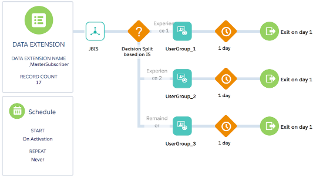

# JBIS: Marketing Cloud Journey Builder activity for Interaction Studio

JBIS is a Custom Journey Builder activity that allows to send Interaction Studio Actions/Events directly from Journey Builder, and to receive IS consumer profile back in MC. 

In a nutshell, this activity allows you to receive segment membership and recommendations (and other information) from IS and use this information in your Journey. For example for decision splits or anything else.

The following profile information is sent back to MC:
* List of segments
* List of recommendations (based on any recipe)
* Up to three user attributes
* User Group (values could be either “Control” or “Default” for IS A/B tests)
* Experience

## What can be done

JBIS allows to receive real-time information about a customer from Interaction Studio. This information can be used to for:

* Next Best Path decision splits in journeys - based on the recommendations from Recipes/Bandit, segments or experiences
* Data capture - save captured information to dataextensions to process it later
* Build Segments in IS based on the Journeys user is in

## High-level architectural diagram

## Interaction Studio setup

### Open IS and create a new “Server Side Campaign”

### Configure campaign output

* Set the name of the Campaign
* Set the name of the Experience
* Set the value of the Target attribute (could be any non-empty value, eg: “-”) 
* Add the following fields. _All fields are optional_. Use Attributes (attribute, attribute2, attribute3) to pass any information back to MC. *Attribute valuesare just examples*

### IMPORTANT: When profile data can't be sent back to MC (When Server-Side campaigns are not returned):

* A campaign includes “Promoted Content” (eg: recipe recommendations) and this recipe does not return the min number of required recommendations. Make sure that your recipe returns smth for your test users
* A campaign includes a “Custom User Attribute” and the user does not have a value set for this attribute. Make sure that your test users have values for the attributes used in the campaign. _*Check a small workaround below*_

*Preview your Server-Side Campaigns for your test users before setting up a Journey in MC* 
*All fields described below are optional. Only use the ones that you need in your journey*

### Workaround for “Custom User Attributes”

Use the following pattern for Custom User Attributes:

`#field([YOUR_USER_ATTRIBUTE_SUBSTITUTION_STRING], '')`

#### Example:

Attribute substitution string: 

`${user.attributes.country}`

Value that you should use in your Server-Side campaign: 

`#field(${user.attributes.country}, '')`

Name | Value | Type | Description
--- | --- | --- | ---
segments | ${tools.user.get('SegmentNames','none')} | Text | Comma separated list of segments.
recommendations | $items | Promoted Content | Comma separated list of recommended item IDs
attribute | Example: #field(${user.attributes.country},'') | Text | Any attribute. Use "Dynamic" attribute selector menu. EG: ${user.attributes.country}
attribute2 | Example: #field(${user.attributes.language},'') | Text | Any attribute. Use "Dynamic" attribute selector menu. EG: ${user.attributes.country}
attribute3 | Example: #field(${user.attributes.score},'') | Text | Any attribute. Use "Dynamic" attribute selector menu. EG: ${user.attributes.country}
